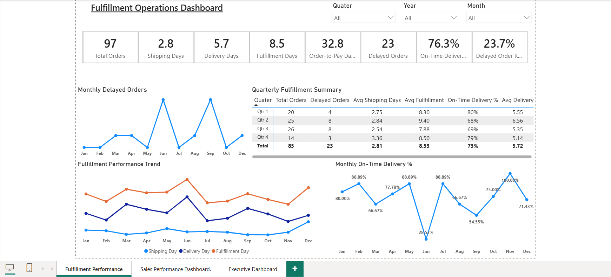
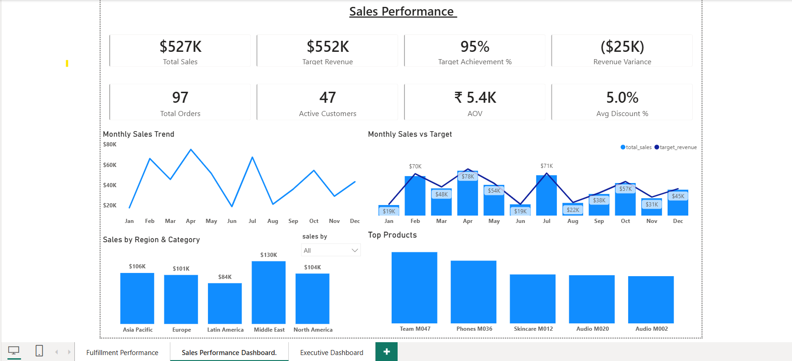
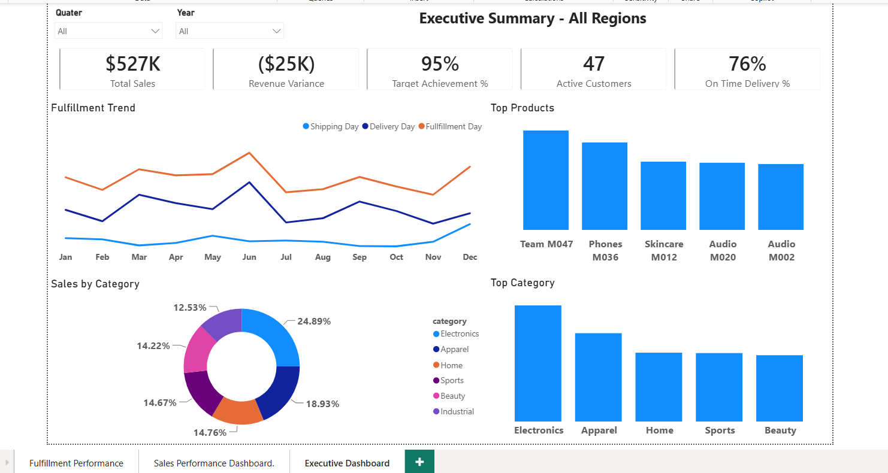

# Power BI Data Modeling — Sales & Operations Analytics

## 📌 Project Overview

This project demonstrates an end-to-end **Power BI data modeling workflow**, focused on transforming a complex and fragmented source data model into a clean, scalable, and analytics-ready **semantic model**.

The project follows a structured **dimensional modeling approach**, covering data exploration, fact and dimension design, Star Schema development, relationship management, DAX measures, Row-Level Security (RLS), model validation, and analytical reporting.

The primary focus is on building a reliable data model that supports accurate and scalable business analysis.

---

## 🎯 Project Objectives

- Analyze and understand a complex source data model
- Identify business entities, facts, dimensions, and table grain
- Consolidate and standardize dimension data
- Design fact tables around business events
- Build a scalable Star Schema
- Create appropriate relationships between facts and dimensions
- Develop reusable DAX measures
- Implement Row-Level Security (RLS)
- Validate model structure and business numbers
- Build analytical reporting on top of the semantic model

---

## 🔄 Data Modeling Workflow

The project followed a structured four-phase modeling process:

```text
Source Data
    ↓
Prepare & Explore
    ↓
Build Dimensions
    ↓
Build Facts
    ↓
Star Schema
    ↓
Polish & Validate
    ↓
Analytics-Ready Semantic Model
    ↓
Power BI Reporting
```

---

## 🔍 Key Modeling Work

### 1. 🔎 Prepare & Explore

- Explored the existing source data model
- Identified key business entities and table purposes
- Determined the **grain** of each table
- Identified **fact and dimension tables**
- Identified structural and data quality issues

---

### 2. 🧩 Build Dimensions

- Consolidated related source tables
- Cleaned and standardized dimension data
- Created appropriate keys
- Applied consistent naming conventions
- Removed unnecessary columns

---

### 3. 📊 Build Facts

- Identified key business events
- Defined the **fact table grain**
- Identified required dimensional keys
- Structured fact tables around measurable business events
- Connected fact tables to appropriate dimensions

---

### 4. ✅ Polish & Validate

- Reviewed table and column naming
- Verified relationships and filter propagation
- Performed model quality checks
- Validated business calculations and key totals
- Reviewed and finalized the overall model structure

---

## ⭐ Star Schema

The final semantic model follows a **Star Schema architecture**, with fact tables connected to reusable descriptive dimensions.

### Data Model Preview

 

### Modeling Standards

| Standard | Description |
|---|---|
| `dim_` prefix | Used for dimension tables |
| `fact_` prefix | Used for fact tables |
| `snake_case` | Consistent column naming convention |
| `_key` / `_id` | Consistent key naming |
| Business-friendly names | Clear and understandable field names |
| Fact/Dimension separation | Clear distinction between business events and descriptive entities |

---

## 🧮 DAX & Row-Level Security

### DAX

Developed reusable **DAX measures** to support key analytical requirements, including:

- 💰 Sales performance
- 📦 Order performance
- 👥 Customer analysis
- 🎯 Budget vs. performance analysis
- ⚙️ Operational performance
- 📅 Time-based analysis

A dedicated **Date Dimension** supports consistent time-based analysis and period-based reporting.

### 🔐 Row-Level Security

Implemented **Row-Level Security (RLS)** to control data visibility based on the user's access scope.

This ensures that users can access only the data relevant to their assigned business scope.

---

## 📊 Reporting

The semantic model provides the foundation for analytical reporting across:

- 💰 Sales
- 👥 Customers
- 📦 Products
- 🌍 Geography
- 🏪 Stores
- 👤 Salespeople
- 📅 Time
- ⚙️ Operations

### Executive Summary



### Sales Performance



### Fulfillment Performance



The structured semantic model enables reports to consume **consistent, reusable, and centralized business logic**.

---

## 🛠️ Tools & Technologies

| Technology | Purpose |
|---|---|
| **Power BI** | Data modeling and reporting |
| **Power Query** | Data preparation and transformation |
| **DAX** | Analytical calculations and measures |
| **Dimensional Modeling** | Data model design |
| **Star Schema** | Semantic model architecture |
| **Row-Level Security** | Data access control |

---

## 📁 Repository Structure

```text
power-bi-data-modeling/
│
├── README.md
│
├── PowerBI/
│   └── My_Datamodel.pbix
│
├── Documentation/
│
└── Screenshots/
    ├── final_data_model.png
    ├── executive_summary.png
    ├── sales_performance.png
    └── fulfillment_performance.png
```

### 📂 Folder Overview

| Folder | Contents |
|---|---|
| `PowerBI/` | Power BI semantic model (`.pbix`) |
| `Documentation/` | Supporting project documentation |
| `Screenshots/` | Data model and report screenshots |

---

## 🙏 Attribution

This project was completed as a **hands-on learning and portfolio exercise** based on the Power BI Data Modeling project by **Data with Baraa**.

Credit to **Data with Baraa** for the project concept, learning material, and guidance.

### 🎥 Original Project

[Power BI Data Modeling Project — Data with Baraa](https://youtu.be/0A2k62YEbfI)

---

## 👩‍💻 Author

### Sowmya Kota

**Senior Data Analyst | Power BI | SQL | Data Analytics**

Focused on building **reliable data models** and transforming business data into **meaningful analytical insights**.
